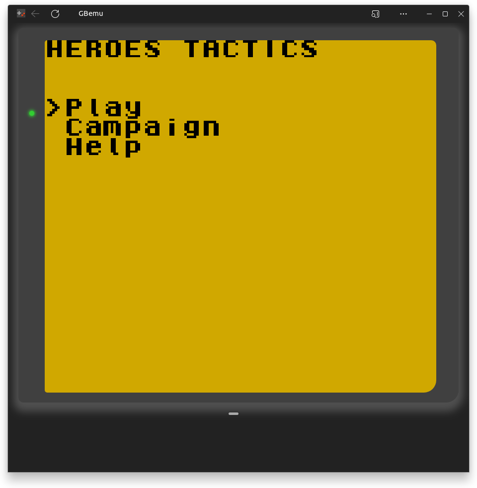
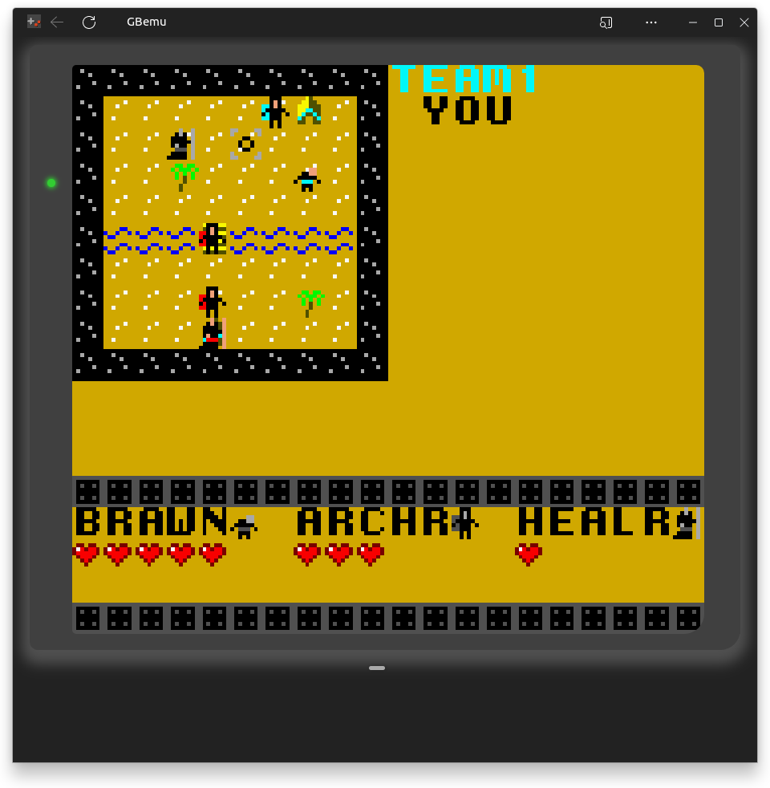
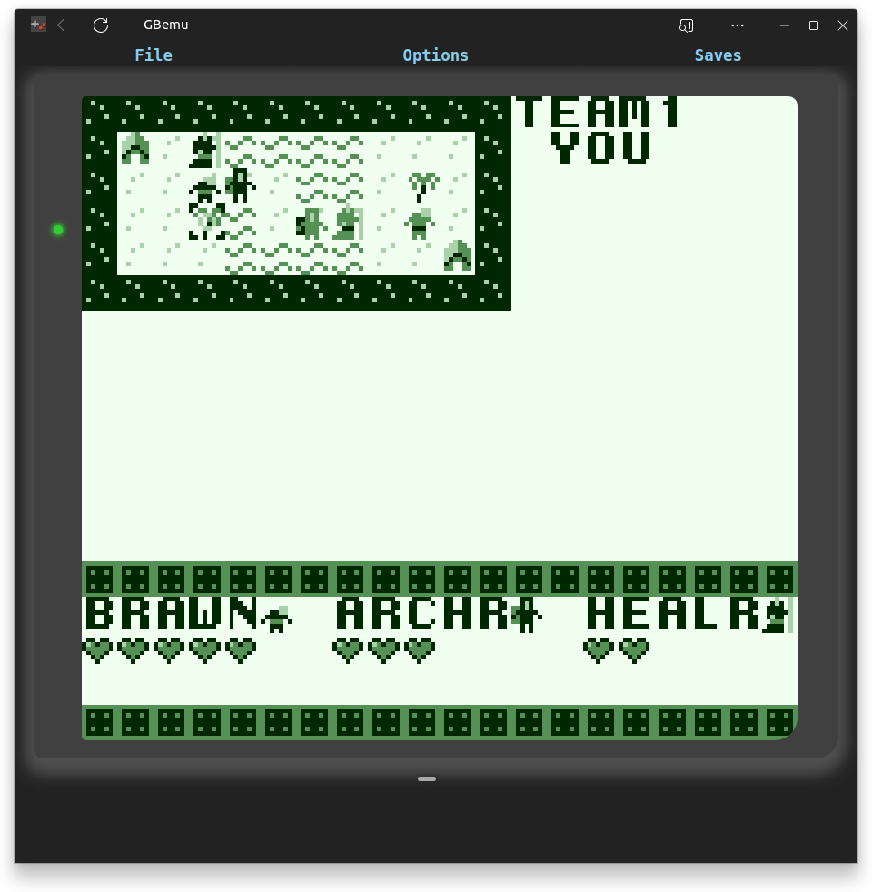

# Heroes Tactics

### A turn-based strategy game for the Nintendo GameBoy inspired by the Fire Emblem series
 
 - written in C and compiled using [GBDK](https://github.com/gbdk-2020/gbdk-2020)
 - features AI and link cable support

## Controls
 - **A** select unit
 - Hold **B** to view a unit's attack range
 - Hold **SELECT** view details about a tile
 - **START** end turn

Main Menu

Early stages of a battle

Battle on another map (emulated on the original Gameboy)

